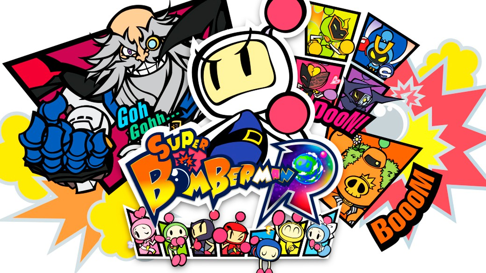

# TRABAJO PRÁCTICO FINAL

## BOMBERMAN 💣

Alumnos:  Ivan Cotti
          

Para la entrega final de la materia elegímos crear una imitación del famoso juego "BOMBERMAN". Muchos ya lo conocen, pero pasamos a hacer una introducción:

          Bomberman tuvo su primer aparición en el año 83. Si bien hasta la actualidad fue sufriendo varias actualizaciónes, la idea siempre fue la misma. Consta del personaje princial, Bomber, quien tiene como objetivo eliminar a sus enemigos. ¿Como lo hace? Bomber va dejando bombas en el camino que al explotar destruyen obstáculos y, en caso de alcanzarlos, elimina a los enemigos. Bomber también puede ir consumiendo comestibles que van apareciendo en el mapa, estos pueden incrementar su velocidad o expandir el rango de la explosión de sus bombas. Al eliminár a todos los enemigos, se da por ganado el nivel y se pasa automáticamente al próximo.

Llegó el momento de que lo prueben ustedes mismos! Antes que comience la partida, encontrarán una pantalla de instrucciones 😀😁

